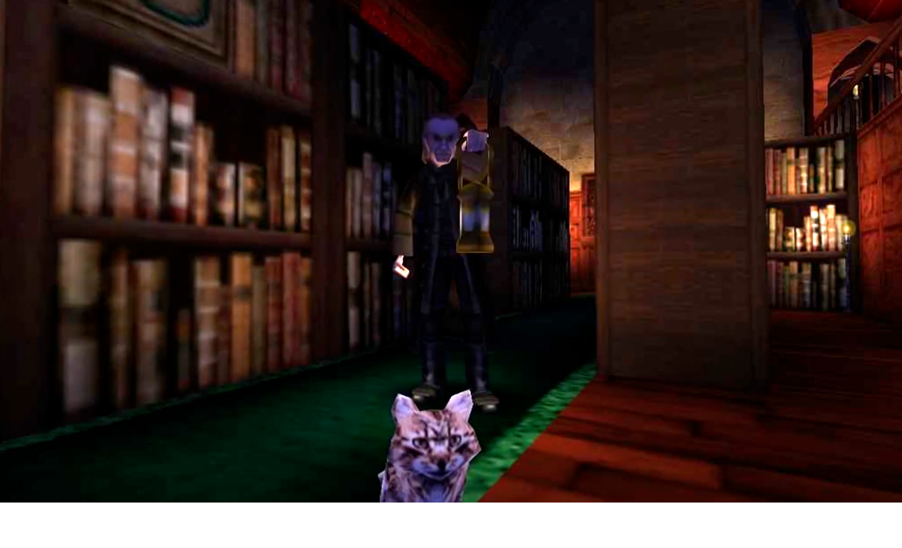
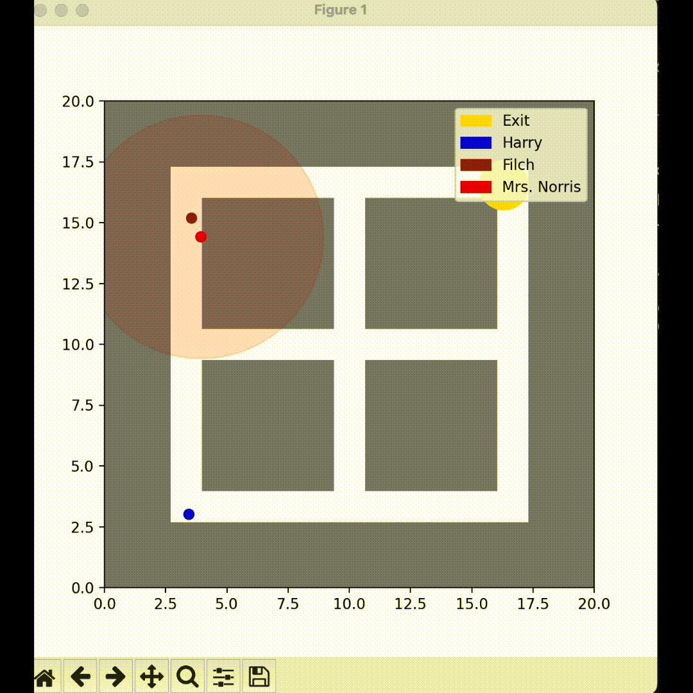
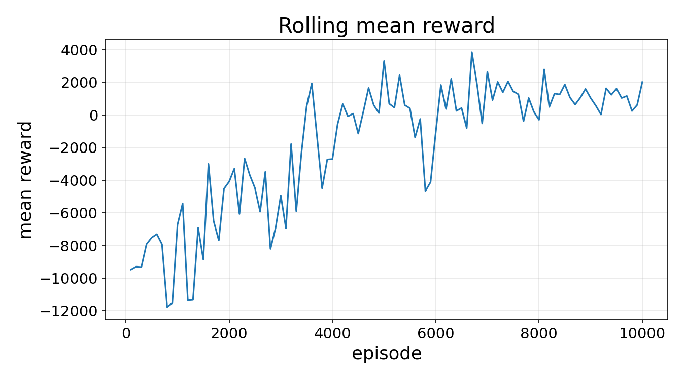
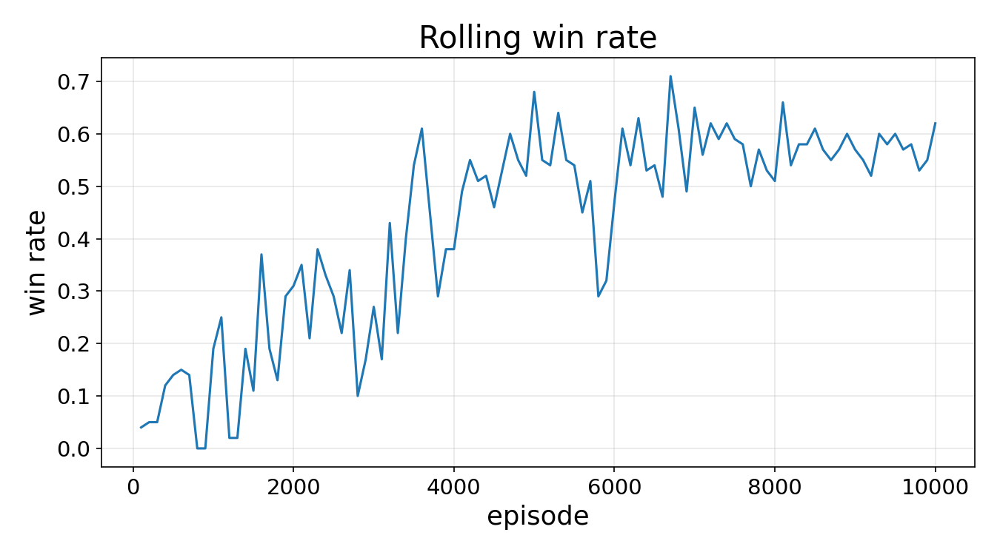
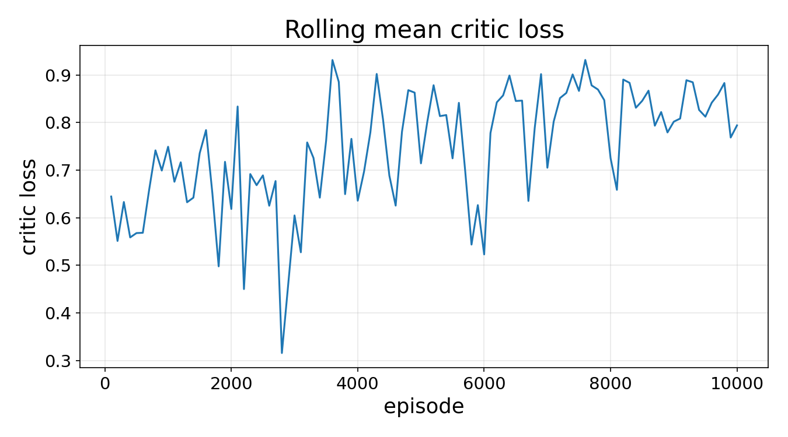

# Reinforcement Learning: Hogwarts Stealth Navigation

This repository implements a custom continuous-space Reinforcement Learning environment where an agent (Harry) must navigate a 2D map to reach a goal while avoiding dynamic adversaries (Filch and Mrs. Norris) and static obstacles (walls). The project explores the effectiveness of Advantage Actor-Critic (A2C) and Proximal Policy Optimization (PPO) algorithms using both Multi-Layer Perceptron (MLP) and Convolutional Neural Network (CNN) architectures.

## Problem Setup
The environment is a continuous 2D field. The agent must reach a randomly spawned goal while managing not being caught by enemies. Filch patrols random waypoints, while Mrs. Norris actively tracks the agent if it enters her smell radius and line of sight. Collisions with walls or enemies result in immediate termination (loss).

---

## Markov Decision Process (MDP) Formulation

We model the problem as an MDP defined by the tuple $(\mathcal{S}, \mathcal{A}, \mathcal{P}, \mathcal{R}, \gamma)$.

### 1. State Space ($\mathcal{S}$)
The state $s \in \mathcal{S}$ represents the agent's observation of the environment. We explored two representations:
* **Vectorial (MLP):** $s \in \mathbb{R}^{d}$. Contains absolute coordinates of the agent and goal, the "last seen" memory coordinates of the enemies, decay timers representing memory fading, and the minimum relative distance to the nearest wall segments.
* **Spatial (CNN):** A grid representation $s \in \mathbb{R}^{C \times H \times W}$ (specifically $4 \times 64 \times 64$). Channels represent: (0) Walls, (1) Agent, (2) Goal, (3) Fading memory heatmap of enemies.

### 2. Action Space ($\mathcal{A}$)
The action $a \in \mathcal{A}$ is a continuous 2D vector dictating the agent's movement:
$$a = [dx, dy] \in [-1, 1]^2$$
The actual movement is scaled by the agent's speed parameter.

### 3. Transition Function ($\mathcal{P}$)
The transition dynamics $\mathcal{P}(s_{t+1}|s_t, a_t)$ are deterministic for the agent's kinematics but semi-stochastic due to the enemies' random waypoint generation.

### 4. Reward Formulation ($\mathcal{R}$)
The reward function $r_t = \mathcal{R}(s_t, a_t)$ is designed to encourage speed and stealth, keeping the distance from enemies high, shaped as:
$$r_t = -c_{time} - c_{goal}\|s^{(goal)} - s^{(agent)}\|^2 + c_{enemy}\sum_{i \in E}\|s^{(enemy_i)} - s^{(agent)}\|^2$$
Terminal rewards:
* $r_{win} = +10000$ (Goal reached)
* $r_{lose} = -1000$ (Caught or hit wall)

*(Note: Raw values were scaled during training to stabilize the Critic network).*

---

## Methods and Architectures

### Architectures
* **MLP:** Used for the flat observation space.
* **CNN Feature Extractor:** Used for the spatial grid

### Algorithms
We assume a parameterized policy $\pi^{\theta}(a|s)$ (Actor) and a state-value function $V^{\pi}(s)$ (Critic).

#### 1. Advantage Actor-Critic (A2C)
Implemented in two variations: **Shared** (shared base layers) and **Separated** (independent networks). 
The Advantage is estimated with time-difference (TD) loss:
$$A_t = r_t + \gamma V^{\pi}(s_{t+1}) - V^{\pi}(s_t)$$

The Actor is updated via:
$$\nabla_{\theta} J(\theta) \approx \mathbb{E} [\nabla_{\theta} \log \pi^{\theta}(a_t|s_t) A_t]$$

The Critic is updated via MSE:
$$L(\phi) = \frac{1}{2} \mathbb{E} [(r_t + \gamma V_{\phi}(s_{t+1}) - V_{\phi}(s_t))^2]$$

#### 2. Proximal Policy Optimization (PPO)
To prevent catastrophic policy updates, we used PPO-Clip. We define the probability ratio:
$$r_t(\theta) = \frac{\pi^{\theta}(a_t|s_t)}{\pi^{\theta_{old}}(a_t|s_t)}$$

The clipped surrogate objective is:
$$L_{CLIP}(\theta) = \mathbb{E} [\min(r_t(\theta)A_t, \text{clip}(r_t(\theta), 1-\epsilon, 1+\epsilon)A_t)]$$

---

## Implementation Challenges & Solutions

1. **The "Wall-Hugging" / Boundary Problem:**
   * *Problem:* Absolute coordinates of static walls made it difficult for the MLP to learn collision avoidance.
   * *Solution:* Transitioned to **relative point-to-line-segment distances** to the closest wall. 
2. **Problem avoidance:**
   * *Problem:* Lose reward $-10000$ was too big, forcing agent to live longer being stuck in corner.
   * *Solution:* Scaled lose reward to be smaller than potential time loss reward, forcing exploration.
3. **Observation Complexity:**
   * *Problem:* Vector of observation lacked information.
   * *Solution:* Used a 4-channel $64 \times 64$ artificial map coupled with a CNN instead of vectorial observation features (such as agent and enemies positions).

---

## Results

### Training Metrics

*Figure 1: Уpisode rewards over time.*

*Figure 2: Winrate percentage evaluated at fixed epoch intervals.*

*Figure 3: Critic Loss dynamics.*

### Conclusion
Actor-Critic with CNN reached the acceptable performance over limited training time, other architectures didn't provide results better than starting ones. So, further comparison of all architectures can be done.
