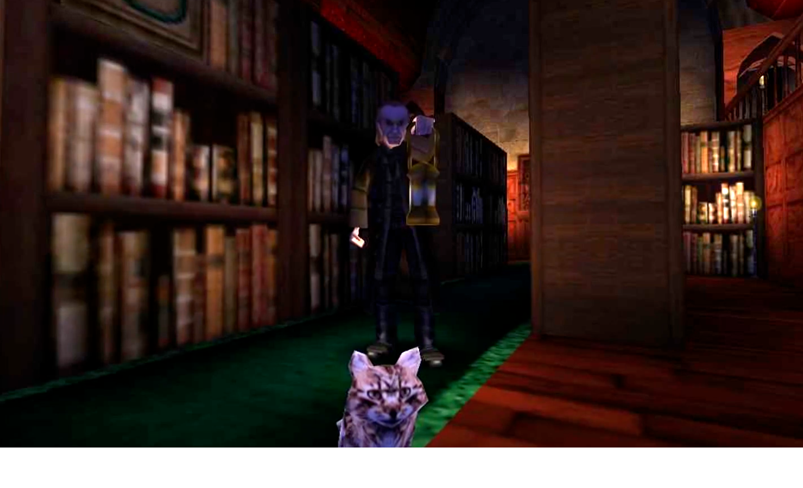
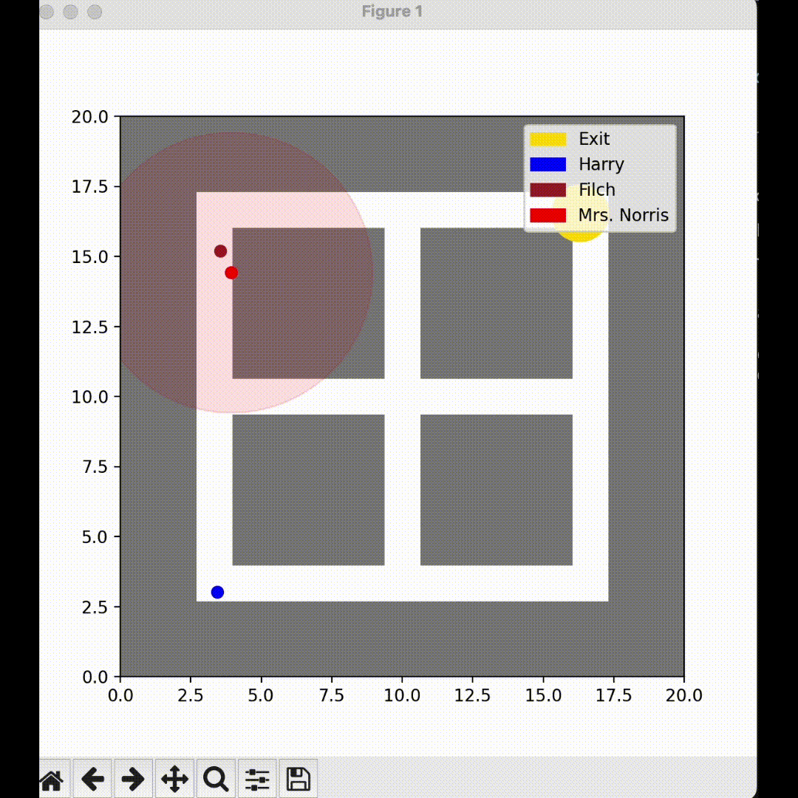
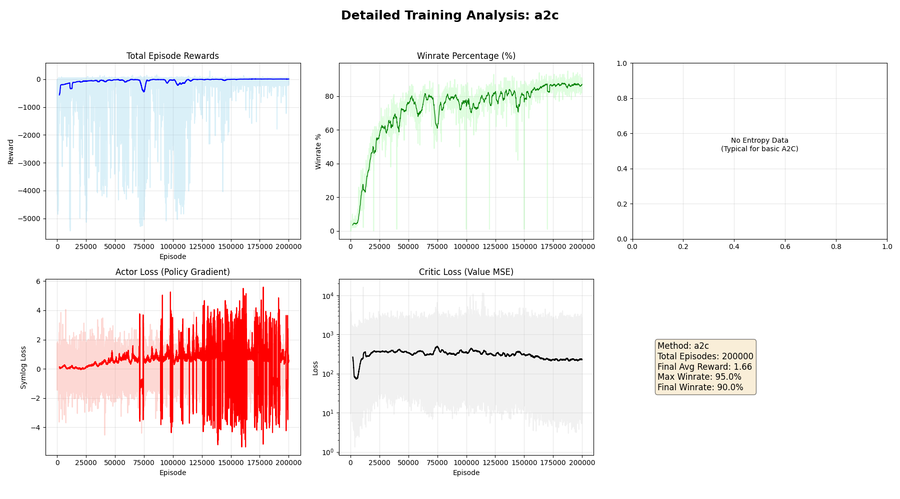
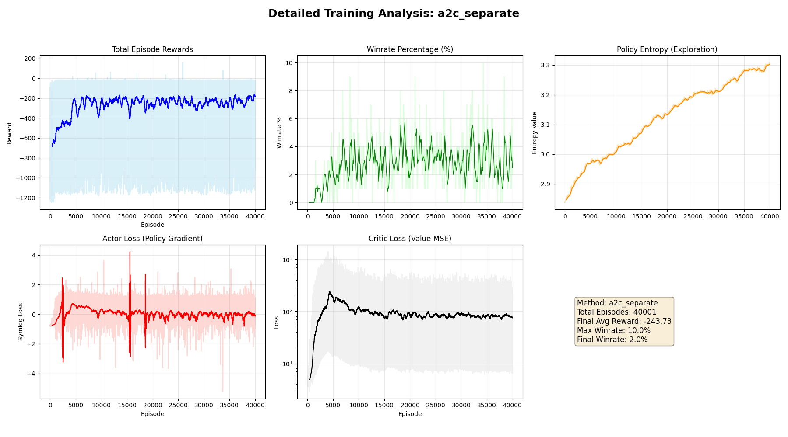
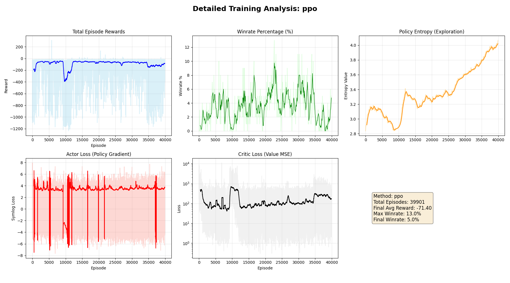
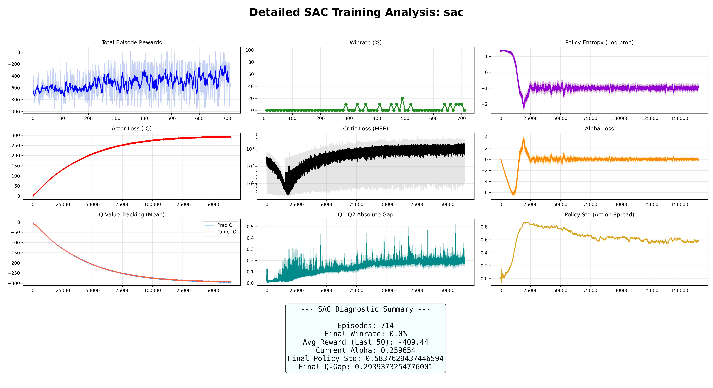

# Reinforcement Learning: Hogwarts Stealth Navigation

This repository implements a custom continuous-space Reinforcement Learning environment where an agent (Harry) must navigate a 2D map to reach a goal while avoiding dynamic adversaries (Filch and Mrs. Norris) and static obstacles (walls). The project explores the effectiveness of Advantage Actor-Critic (A2C) and Proximal Policy Optimization (PPO) algorithms using both Multi-Layer Perceptron (MLP) and Convolutional Neural Network (CNN) architectures.

## Problem Setup
The environment is a continuous 2D field. The agent must reach a randomly spawned goal while managing not being caught by enemies. Filch patrols random waypoints, while Mrs. Norris actively tracks the agent if it enters her smell radius and line of sight. Collisions with walls or enemies result in immediate termination (loss).

---

## Markov Decision Process (MDP) Formulation

We model the problem as an MDP defined by the tuple $(\mathcal{S}, \mathcal{A}, \mathcal{P}, \mathcal{R}, \gamma)$.

### 1. State Space ($\mathcal{S}$)
The state $s \in \mathcal{S}$ represents the agent's observation of the environment. We explored two representations:
* **Vectorial (MLP):** $s \in \mathbb{R}^{d}$. Contains absolute coordinates of the agent and goal, the "last seen" memory coordinates of the enemies, decay timers representing memory fading, and the minimum relative distance to the nearest wall segments.
* **Spatial (CNN):** A grid representation $s \in \mathbb{R}^{C \times H \times W}$ (specifically $4 \times 64 \times 64$). Channels represent: (0) Walls, (1) Agent, (2) Goal, (3) Fading memory heatmap of enemies.

### 2. Action Space ($\mathcal{A}$)
The action $a \in \mathcal{A}$ is a continuous 2D vector dictating the agent's movement:
$$a = [dx, dy] \in [-1, 1]^2$$
The actual movement is scaled by the agent's speed parameter.

### 3. Transition Function ($\mathcal{P}$)
The transition dynamics $\mathcal{P}(s_{t+1}|s_t, a_t)$ are deterministic for the agent's kinematics but semi-stochastic due to the enemies' random waypoint generation.

### 4. Reward Formulation ($\mathcal{R}$)
The reward function $r_t = \mathcal{R}(s_t, a_t)$ is designed to encourage speed and stealth, keeping the distance from enemies high, shaped as:
$$r_t = -c_{time} - c_{goal}\|s^{(goal)} - s^{(agent)}\|^2 + c_{enemy}\sum_{i \in E}\|s^{(enemy_i)} - s^{(agent)}\|^2$$
Terminal rewards:
* $r_{win} = +10000$ (Goal reached)
* $r_{lose} = -1000$ (Caught or hit wall)

*(Note: Raw values were scaled during training to stabilize the Critic network).*

---

## Methods and Architectures

### Architectures
* **MLP:** Used for the flat observation space.
* **CNN Feature Extractor:** Used for the spatial grid

### Algorithms
We assume a parameterized policy $\pi^{\theta}(a|s)$ (Actor) and a state-value function $V^{\pi}(s)$ (Critic).

#### 1. Advantage Actor-Critic (A2C)
Implemented in two variations: **Shared** (shared base layers) and **Separated** (independent networks). 
The Advantage is estimated with time-difference (TD) loss:
$$A_t = r_t + \gamma V^{\pi}(s_{t+1}) - V^{\pi}(s_t)$$

The Actor is updated via:
$$\nabla_{\theta} J(\theta) \approx \mathbb{E} [\nabla_{\theta} \log \pi^{\theta}(a_t|s_t) A_t]$$

The Critic is updated via MSE:
$$L(\phi) = \frac{1}{2} \mathbb{E} [(r_t + \gamma V_{\phi}(s_{t+1}) - V_{\phi}(s_t))^2]$$

#### 2. Proximal Policy Optimization (PPO)
To prevent catastrophic policy updates, we used PPO-Clip. We define the probability ratio:
$$r_t(\theta) = \frac{\pi^{\theta}(a_t|s_t)}{\pi^{\theta_{old}}(a_t|s_t)}$$

The clipped surrogate objective is:
$$L_{CLIP}(\theta) = \mathbb{E} [\min(r_t(\theta)A_t, \text{clip}(r_t(\theta), 1-\epsilon, 1+\epsilon)A_t)]$$

#### 3. Soft Actor-Critic (SAC)

Soft Actor-Critic was implemented as an off-policy actor-critic method for the continuous action version of the task. Unlike A2C and PPO, SAC learns from a replay buffer and optimizes a maximum-entropy objective, encouraging the policy to both maximize return and preserve exploration.

The SAC objective is:

$$
J(\pi) = \mathbb{E}_{\pi}\left[\sum_{t=0}^{T}\gamma^t\left(r_t + \alpha \mathcal{H}(\pi(\cdot|s_t))\right)\right]
$$

where $\alpha$ is the entropy temperature coefficient and $\mathcal{H}(\pi(\cdot|s_t))$ is the policy entropy.

The policy is modeled as a Gaussian distribution:

$$
a_t \sim \pi_{\theta}(a_t|s_t) = \mathcal{N}(\mu_{\theta}(s_t), \sigma_{\theta}(s_t))
$$

The sampled action is then squashed to the valid range:

$$
a_t \in [-1,1]^2
$$

SAC uses two critic networks to reduce overestimation bias:

$$
Q_{\phi_1}(s,a), \quad Q_{\phi_2}(s,a)
$$

The target value is computed using the minimum of the two target critics:

$$
y_t = r_t + \gamma(1-d_t)\left(\min_{i=1,2}Q_{\bar{\phi}_i}(s_{t+1},a_{t+1}) - \alpha \log \pi_{\theta}(a_{t+1}|s_{t+1})\right)
$$

The critic loss is:

$$
L_Q(\phi_i) = \mathbb{E}\left[(Q_{\phi_i}(s_t,a_t) - y_t)^2\right]
$$

The actor is updated by minimizing:

$$
L_{\pi}(\theta) =
\mathbb{E}\left[\alpha \log \pi_{\theta}(a_t|s_t) - \min_{i=1,2}Q_{\phi_i}(s_t,a_t)\right]
$$

The entropy temperature $\alpha$ is adjusted automatically using:

$$
L_{\alpha} =
-\mathbb{E}\left[\alpha(\log \pi_{\theta}(a_t|s_t) + \mathcal{H}_{target})\right]
$$

In this project, SAC was trained using a replay buffer storing transitions:

$$
(s_t,a_t,r_t,s_{t+1},d_t)
$$

This makes SAC different from A2C and PPO: instead of updating only from the most recent trajectory, SAC repeatedly samples past transitions, improving sample efficiency.

---

## Implementation Challenges & Solutions

1. **Wall-Hugging / Boundary Problem**
   * *Problem:* Absolute wall coordinates were not informative enough for the MLP policy. The agent often failed to understand how close it was to obstacles and learned to move along boundaries or get stuck near walls.
   * *Solution:* Replaced raw wall coordinates with **relative point-to-line-segment distances** to the nearest wall segments. This made collision risk more explicit in the observation.

2. **Reward Scale and Problem Avoidance**
   * *Problem:* A very large terminal loss, such as $r_{lose}=-10000$, made the agent overly conservative. Instead of learning to reach the goal, it often preferred to survive as long as possible or stay in low-risk corners.
   * *Solution:* Reduced the terminal loss magnitude and balanced it against the time penalty and distance-based shaping terms. This encouraged the agent to explore and made reaching the goal more attractive than passive survival.

3. **Observation Complexity**
   * *Problem:* The vector observation did not contain enough spatial structure for reliable navigation. Important information such as wall geometry, goal position, and enemy memory was difficult to encode compactly.
   * *Solution:* Introduced a **4-channel $64 \times 64$ spatial observation** and trained CNN-based policies. The channels encode walls, the agent position, the goal position, and fading enemy memory.

4. **SAC Stability**
   * *Problem:* SAC was difficult to stabilize in this environment. The main issues were large shaped rewards, noisy critic learning from CNN observations, continuous action exploration leading to unsafe wandering, and sensitivity to entropy coefficient tuning.
   * *Solution:* SAC was kept as an additional comparison method, but its results were treated as exploratory. It represents a different family of algorithms: **off-policy maximum-entropy reinforcement learning**, while A2C and PPO are on-policy actor-critic methods.

---

## Results

### Training Metrics

*Figure 1: A2C_shared metrics over time.*

*Figure 2: A2C_separate metrics over time.*

*Figure 3: PPO metrics over time.*

*Figure 4: SAC metrics over time.*

### Conclusion
The CNN-based shared Actor-Critic approach achieved the strongest performance within the available training time. It was able to use the spatial $64 \times 64$ map representation effectively and reached an acceptable win rate.

MLP-based observations and separated actor-critic architectures were less reliable, suggesting that the spatial structure of the environment is important for learning the navigation task. Separate A2C, PPO and SAC provided useful comparisons, but in the current setup they were harder to tune and did not reach the same level of performance as the shared CNN Actor-Critic model.

Further work can include longer training, more systematic hyperparameter tuning, improved reward normalization, and a broader comparison between A2C, PPO, and SAC under equal computational budgets.
